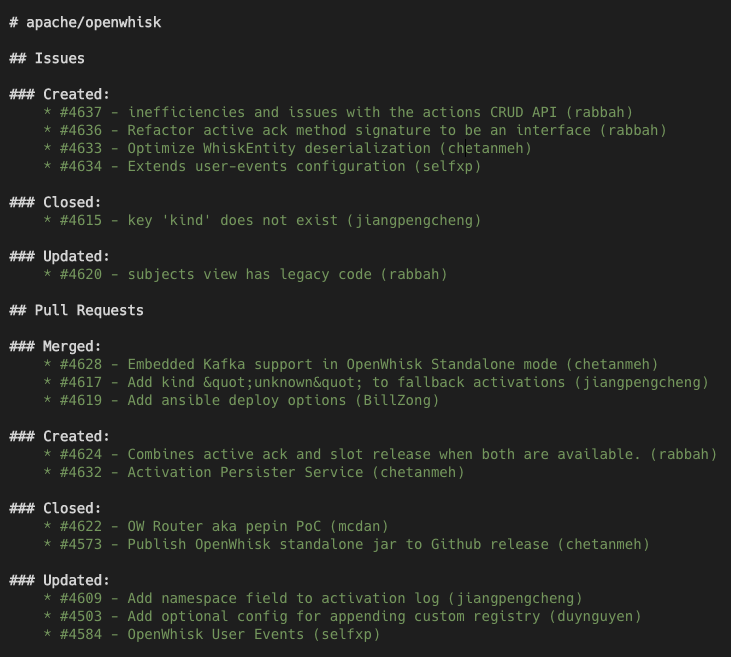
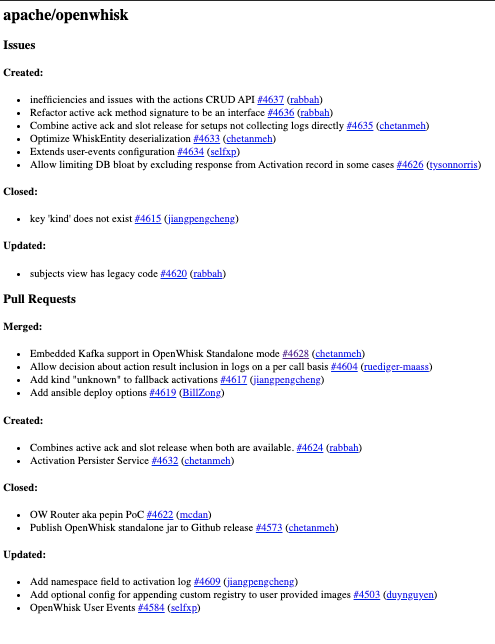

[](http://www.apache.org/licenses/LICENSE-2.0) 
[](https://github.com/adobe/github-reporter/actions)
[](https://codecov.io/gh/adobe/github-reporter)
 

# Github Report Generator

This tool enables generating change report for a set of github repositories. Such a report helps a team to get a high level
overview of work being done across multiple repositories.

```bash
$ curl -L https://github.com/adobe/github-reporter/releases/download/v0.1-beta/github-reporter-0.1-beta.jar -o github-reporter.jar
$ java -jar github-reporter.jar --since "2 days" apache/openwhisk 
```

If you get an error like _"API rate limit exceeded"_ then you would need to configure a [personal access token][2] via `-t` option.
See [rate limits][6] for detail. While creating the token you do not have to select any specific scope.

Download the current snapshot release from [here][1]

The generated report looks like below

| Markdown             |  HTML |
:-------------------------:|:-------------------------:
  |  

It supports multiple options

1. Connect to internal github deployment (via `--github-uri`)
2. Generate report for all repo in an org (via `--org apache --repo-prefix openwhisk`)
3. Render markdown or html report (`--html-mode`)
4. Pass access token for higher rate limits
5. Send mail

```
$ java -jar build/libs/github-reporter-1.0-SNAPSHOT.jar -h
      --github-uri  <arg>    Github server uri. By default it refers to public
                             github. If your repo is on an internal enterprise
                             deployment then set this to the server url
      --html-mode            Render in HTML mode. By default report is rendered
                             in Markdown format
      --json-mode            Render in json mode. If enables then another report
                             in json mode would also be rendered
      --org  <arg>           Organization name. Reporter would find its
                             repositories and generate report for them. If any
                             prefix if provided then only those repo would be
                             selected
  -o, --out  <arg>           Output file path
      --repo-prefix  <arg>   Repo name prefix. If provided only repo whose name
                             start with the provided prefix would be used
  -s, --since  <arg>         Date since changes need tobe reported in yyyy-MM-dd
                             format. One can also provide duration like '4
                             days`, '1 month'
  -t, --token  <arg>         Github access token. See
                             https://help.github.com/en/articles/creating-a-personal-access-token-for-the-command-line
  -h, --help                 Show help message

 trailing arguments:
  repo-names (not required)   List of repository names for which report needs to
                              be generated e.g. apache/openwhisk

Github change reporter
```

Examples

To generate report for last 5 days for all repos in a org https://github.com/apache which start with `openwhisk`

```bash
$ java -jar github-reporter.jar --since "2 days" --org apache --repo-prefix openwhisk -t $GITHUB_TOKEN
```

## Sending mails

Tool supports sending mails also for which you would need to provide mail related options

```
java -jar build/libs/github-reporter-1.0-SNAPSHOT.jar \
    --token <token>>  \
    -Dmail.host=<smtp server> -Dmail.port=587 -Dmail.start-tls=true  \
    -Dmail.from=sender@example.com -Dmail.to=receiver@example.com \
    -Dmail.username=<username> -Dmail.password="<password>" \
    --since 2019-09-11 \
    --json-mode --html-mode \
    --org github-reporter-test
```

Here

* `mail.host` - SMTP host like `smtp.gmail.com` or `mail-relay.apache.org`
* `mail.port` - SMTP port. Generally `587` for STARTTL and `465` for SSL
* `mail.from` - Sender emailId
* `mail.to` - Receiver emailId
* `mail.username` - Username for the account used for authentication
* `mail.password` - Password for the account used for authentication

There are some other options which you can see from [reference.conf](src/main/resources/reference.conf) file

## Build

You can build the jar locally via 

```bash
$ ./gradlew build
```

## Design

This tool is implemented in Scala and uses following libraries

1. [jcabi github][3] - Object Oriented Wrapper of Github API
2. [scalate][4] - For report templates
3. [flexmark-java][5] - For converting markdown to html
 
[1]: https://github.com/adobe/github-reporter/releases/download/v0.1-beta/github-reporter-0.1-beta.jar
[2]: https://help.github.com/en/articles/creating-a-personal-access-token-for-the-command-line
[3]: https://github.com/jcabi/jcabi-github
[4]: https://scalate.github.io/scalate/
[5]: https://github.com/vsch/flexmark-java
[6]: https://developer.github.com/v3/#rate-limiting